## NUS Orbital - Milestone 3 Submission


### Team Name :

Assistant AI 助手 AI

### Proposed Level of Achievement :

Apollo 11

### Index

*   Note: Feel Free to Use Find Command for Quick Searching of the Following Keywords.

1.  Motivation
2.  Aim
3.  User Stories
4.  Tech Stack
5.  Try It Yourself!
6.  Project Scope
7.  Features Summary
8.  Core Features Details
9.  Extension Features Details
10.  Milestone Timeline
11.  Diagrams
12.  Software Engineering Principles
13.  Technical Proof of Concept
14.  Project Log
15.  Mei's Behavior Index
16.  Artist
17.  Art Gallery

### Motivation

Welcome to our web application, 助手 AI , which stands for Assistant AI in Japanese! Our application will be a task management web application that allows users to track and organise their due tasks for better productivity and boosts user engagement via implementing a virtual assistant character.

With our Web Application, we aim to add utility and functionality with personalization. We understand that people have personal, work and familial responsibilities, which are all bound to have tasks to be completed. 助手 AI aims to help users organise tasks, record ongoing progress and provide analytics on their current productivity with a personal Assistant AI to serve reminders and engage users as their own personal characters.

### Aim

Our goal is to develop a task management application that helps users to organize their tasks efficiently and encourage commitment to task fulfillment through a personal rewards system.

### User Stories

1.  As a University student who has a lot of tasks at hand, I sometimes don't feel the motivation to complete my tasks.
2.  As a student who always create and organize my tasks on my smartphone, I wish that someone would help me automate that process through voice commands.
3.  As a Computer Science student who spends most of my time in front of a screen, sometimes I get too carried away and notifications of my tasks would go unnoticed and I would miss a deadline, I wish there was an assistant who would verbally remind me of those tasks.
4.  As a University student who has to juggle between multiple tasks of different levels of priorities, I wished there was AI who could help me with that and give reminders based on deadline priority.

### Tech Stack

1.  Frontend - React, HTML, CSS
2.  Backend - Node.js, Express.js
3.  Database - PostgreSQL
4.  Chatbot - Python, Flask
5.  Unit Testing - Jest, Vitest & React Testing Library

### Try It Yourself!

**We have prepared two ways for users to test out our web application.**

*   **Testing Online**
    *   We have deployed the application in the following manner: The Front-end on Netlify, the Back-end, Database, and Chat Bot on Render.
    *   Please use this link to test our web application: [https://assistantmei.netlify.app](https://assistantmei.netlify.app)
*   **Testing on Local Machine**
    1.  Users are required to have the following installed: Node.js, Express.js, XAMPP, and PostgreSQL.
    2.  After cloning, users need to setup a PostgreSQL database and configure it to the config folder by matching the name and password.
    3.  Run the XAMPP control panel and click on the "start" button for both Apache and PostgreSQL.
    4.  If you wish to test out getting weather information from the AI Assistant, you will have to obtain an API key from OpenWeatherMap.org.
    5.  Create a .env file in the root directory, and add a Secret\_Key, a PORT, and the Weather\_API\_Key variable.
    6.  In the /server directory, open server.js and insert the following code.

```javascript
app.listen(port, () => {
    console.log(`App is listening on ${port}`)
})
```

1.  Run "pip3 install -r requirements.txt" in the terminal of the ChatBot directory to install all python dependencies.
2.  For running the frontend, users may change directory to /client, run "npm install" in the terminal to install all dependencies, and run "npm run dev".
3.  For running the backend, users may change directory to /server, run "npm install" in the terminal to install all dependencies, and run "npm run dev".
4.  For running the chatbot, users may change directory to /ChatBot, and run "python main.py".

### Project Scope

Assistant AI is essentially a task management system with the help of a Virtual Assistant to automate simple tasks for a more interactive user experience.

### Features Summary

#### Core

1.  **The Assistant AI.**
2.  Users to be able to **sign up** for account.
3.  Users to be able to **log in / log out** of account.
4.  Users to be able to **add tasks.**
5.  Users to be able to **edit tasks.**
6.  Users to be able to **delete tasks.**
7.  Users to be able to **complete tasks.**
8.  Users to be able to **uncomplete tasks.**
9.  Users to **receive reminders** on time.
10.  Users to be able to **view tasks by categorisation.**
11.  User **productivity report analysis (based on task completion).**
12.  **Chat with Mei!**
13.  **Quitting an Operation/ Going back a Step**
14.  User voice to provide input to **automate each task.**
15.  **Interactive messages** **(Birthday wishes, greetings, daily life conversations).**

**Extensions**

1.  User Onboarding.
2.  Tasks Prioritisation Suggestion by AI.
3.  Recurring Task (Periodically Recurring Tasks).
4.  Exchange of Points for Decorative Items and Accessories for the Virtual Assistant.

### Core Features Details

*   **Assistant AI**
    *   Why call our web application Assistant AI when we don't even have one present, right?
    *   Meet our user's personal Virtual Assistant AI, Mei!  
        
    *   All character sprites are provided by an artist friend of Jun Xi, Rena (@\_\_rrena on Twitter/ X)! More details of her can be found at the end of this README, including the full set of character sprites that she has provided us for this project.
    *   Mei (めい) is a Japanese high schooler who lives in a virtual school within our web application and she loves to chat and assist anyone who comes to visit her!
    *   Mei acts as our mascot and will be the one users see and interact with the most throughout their experience on our application!

*   **Sign Up**
    *   User to be able to sign up for new account using a **unique** username and password.
    *   Username to be unique, user to face error if signing up for new account using existing username
    *   Users to start off with 0 points
        
        **Instructions/ Details**
        
        *   The screen below is what every new user would see when they click on the Sign Up button.
        
        
        
        *   By entering a unique username, birthdate, and valid password, the new user can press Sign Up at the bottom of the form to submit and create a new account.
        *   A password is valid if and only if it satisfies the following criteria:
            *   At least an uppercase and lowercase alphabet.
            *   At least a number.
            *   At least 8 characters.
        *   Upon Successful sign up, the user will be brought to our home page.
        
        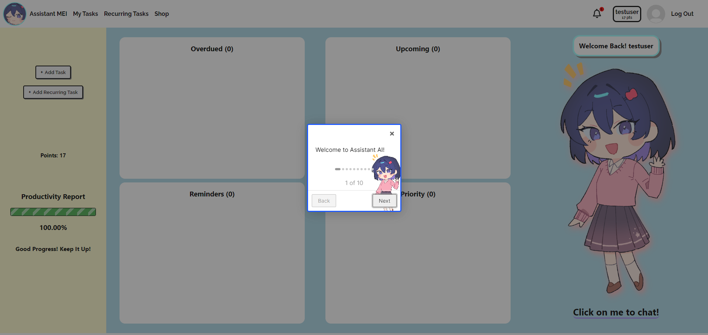
        
*   **Login / Logout**
    *   On Login, users should be redirected to the home page as shown above where there is a dashboard that displays the following:
        *   Tasks by deadline and priority
        *   Reminders of Tasks
        *   User Productivity Rate
    *   On Logout, users should be redirected to the login page
        
        **Instructions/ Details**
        
        *   The screen below is what every new user would see when they click on the Login button.
        
        
        
        *   Existing users can enter their username and password, then press on the Login button at the bottom of the form to login.

*   **Add Tasks**
    *   Users to be able to add tasks with the following fields:
    *   Title
    *   Description
    *   Category
    *   Recurring mode
    *   Priority
    *   Reminder (DateTime)
    *   Deadline (DateTime)
        
        **Instructions/ Details**
        
        *   There are 2 ways for users to add a new task, for this part we will be discussing the first way.
        *   Users can look out for the Add Task button (which should be quite obvious to spot).
        *   The button should look something like this.
        
        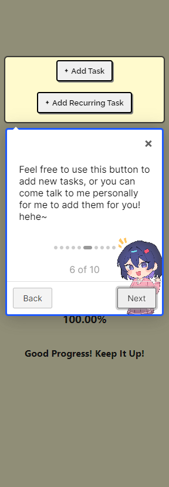
        
        *   When the button is pressed, a form pops up for the user to fill up.
        *   The user will need to enter all the fields as required, then click on the confirmation button to submit.
        
        
        
        *   In the form, users can enable recurring mode to get reminders for the task in set intervals.
        
        
        
        *   A priority level must also be chosen (i.e. Low, Medium, or High)
            
            
            
        *   A deadline in which when passed will result in the task being overdue, and a reminder date when users will receive a reminder for that task can be set under a few conditions.
            *   The deadline and reminder date must not come before the date the task is added.
            *   The reminder date must come before the deadline (It kinda makes sense right?)
            *   Failure to comply to the above conditions will result in an error message.
        
        
        
        *   Once the details are filled up and ready, just click on the ADD button to add the new task!
        
        
        
        *   Afterwards, the newly added task can be found in both the Upcoming and Priority section of the task containers.
        
        
        
*   **Edit Tasks**
    *   Users to be able to edit the following fields for a task:
    *   Title
    *   Description
    *   Category
    *   Recurring mode
    *   Priority
    *   Reminder (DateTime)
    *   Deadline (DateTime)
        
        **Instructions/ Details**
        
        *   To promote a flexible task managing experience, we (just like any other task management applications) allow our users to edit their existing tasks in the case where they change their minds.
        *   So how can users do it? It's simple! Users may notice 3 buttons next to each of their tasks.
        
        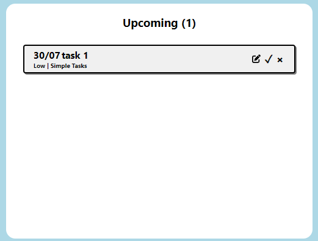
        
        *   And there's the Edit button! Similar, users may click on it to start editing their tasks.
        *   The exact same pop up screen for adding tasks would appear, however this time with the fields filled out according to the task's current data.
        
        
        
        *   And it's also the exact same procedure as Add Task! Just change whichever fields you like, then click on the UPDATE button to edit that task!
        
        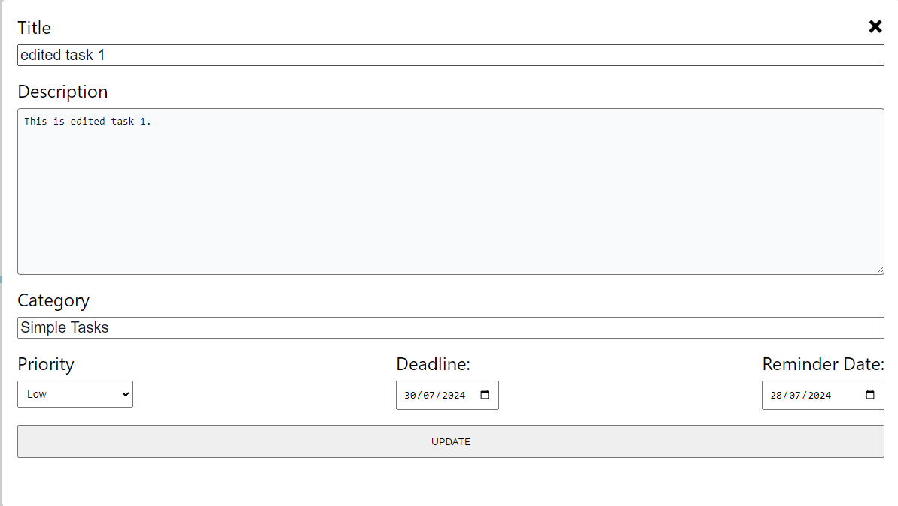
        
        *   The edited task can be found at the usual place.
        
        
        
*   **Delete Tasks**
    *   Users to be able to delete tasks from the dashboard / edit task section
        
        **Instructions/ Details**
        
        *   Take a look at the task containers, other than the Edit button, there are 2 more buttons.
        *   The x button is what users should click to delete unwanted tasks!  
            
        *   Once clicked, a confirmation pop up window will appear, just click DELETE to confirm delete!  
            

*   **Complete Tasks**
    *   Users to be able to press complete task, in which task completion will reward users with XP points. Late completion of tasks will reward with 1 points.
        
        **Instruction**
        
        *   What about the final button? Well, it is a tick, which is to complete a task!
        *   Similarly, there will be a confirmation pop up window, just click on COMPLETE to complete the task!  
            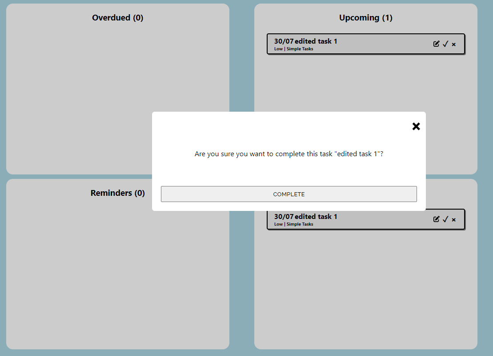
        *   Points based on how early the user has completed the task and the priority level of the task will be calculated and deposited into the user's account.
        *   The points can be found on the left-hand side of the home page, or at the top right corner where the user's information can be found next to the Log Out button.
        *   Hooray! The user has completed their task and earned 17 points!
        
        
        
        
        
*   **Navigation Bar**
    *   Users to be able to navigate through the application using a navigation bar.
        
        **Instructions/ Details**
        
        *   The navigation bar can be found at the top of every page throughout the application.
        *   Users can click on any of them to navigate to the page they desire.  
            

*   **Receive Reminders**
    
    *   Users to receive reminders from the AI Assistant when the task has reached the reminder date.
        
        **Instructions/ Details**
        
        *   As shown in the images above, users are required to enter a reminder date for each task in order for Mei to remind them on time.
        *   Users will be receiving reminders in two different ways.
            1.  Email
                *   An email will be sent out to the user's email address, this is what the email address field at the sign up page is for!
            2.  Reminder Bell
                *   Users may have noticed a bell positioned next to their user profile information in the top right corner.
                *   This reminder bell is shown ringing with a red notification mark to indicate there is a reminder to be read.
                *   
                    
                    When the user clicks on the ringing bell, a reminder window in the form of a chat room pops up, which will then simulate Mei sending the user messages to remind them of their upcoming, overdue, reminder, and most prioritised tasks.
                    
                *   The following image is a sample of a few messages in the reminder window.
                *   
                    
                    Once the reminder has been completed, and the user decides to close the window, the reminder bell will stop ringing and has a green tick next to it.
                    
                    
                    
    
*   **View Tasks - Categorisation**
    *   Users to be able to sort their task list using a sidebar that shows the filters available.
        
        **Instructions/ Details**
        
        *   To view all of the user's tasks, the user can navigate to My Tasks from the navigation bar. (See above)
        *   The user will be able to see the My Tasks page as follows.  
            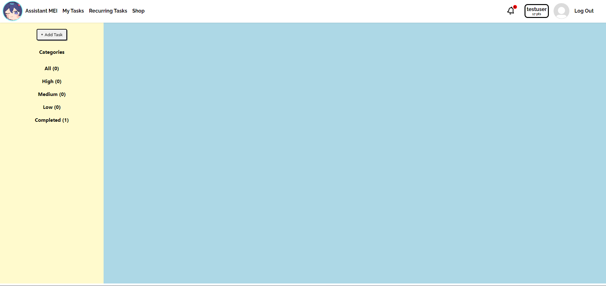
        *   All the tasks have been nicely categorised by Mei into their own categories, as well as by their priority levels.
        *   There's even another Add Task button!  
            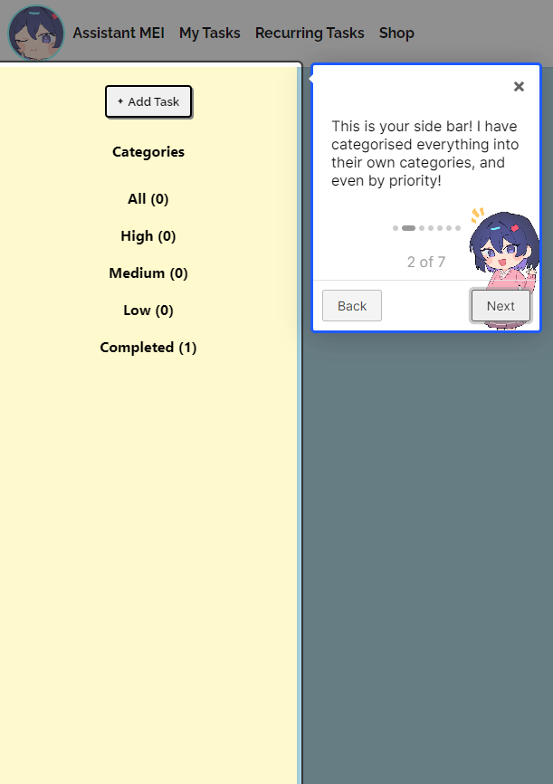
        *   Once the user has added a task, they should be able to view their tasks in detail as shown below.  
            
        *   There are also the same 3 buttons for each tasks to Edit, Complete, or Delete!
            
            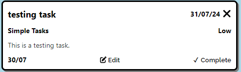
            
*   **Uncomplete Tasks**
    *   Users to be able to press uncomplete task, in which points earned will be deducted.
        
        **Instructions/ Details**
        
        *   Do you remember the task that we have completed previously? Mei doesn't just remove it completely like how she deletes your tasks! Instead, completed tasks are stored in the Completed section of the user's My Tasks page.
        
        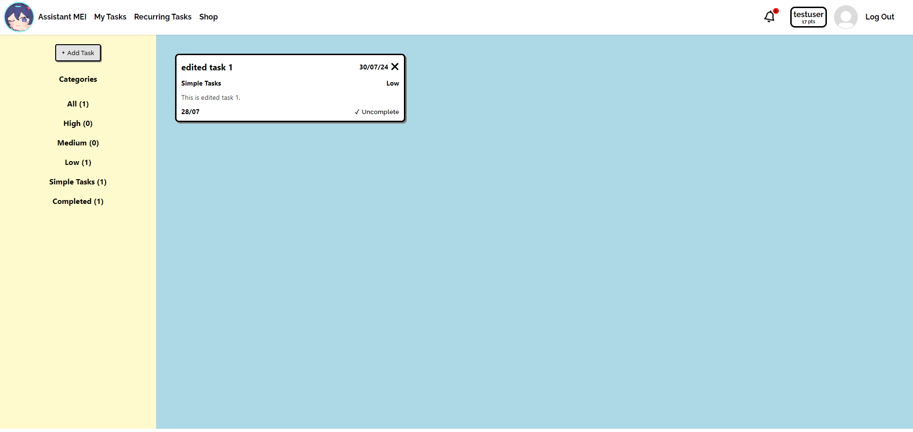
        
        *   Let's zoom in a little, we can observe that instead of the Complete button, there is now an Uncomplete button!
        *   Users can click on it to bring their tasks back to the “Incomplete” status and the points will also be taken out!
        
        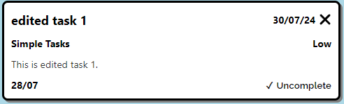
        
        *   As usual, a confirmation pop up window will appear in case of accidents!
            
            
            
*   **Productivity Report**
    *   Generate a productivity report showing productivity rate based on number of tasks completed, date of task completion relative to deadline, and priority of tasks completed.
    *   Tasks completed before the deadline will result in higher productivity.
    *   Tasks completed after the deadline will result in lower productivity.
    *   Tasks yet to be completed after the deadline will also result int lower productivity.
    *   The priority of tasks will affect the weightage and its increase on decrease in productivity rate.
        
        **Instructions/ Details**
        
        *   Other than points, there is one more thing that users can view from the left-hand side in the home page, which is the productivity report!
        
        
        
        *   As mentioned above, only tasks completed on time would result in a higher productivity, so be sure to do them!
            
*   **Chat with Mei!**
    *   A chatroom that allows users to chat with the AI Assistant, Mei.
        
        **Instructions/ Details**
        
        *   Mei's AI model is built in Python using machine learning libraries such as tflearn and tensorflow, as well as the NumPy library to deal with the linear algebra.
        *   Mei has a pre-defined behavior that is stored as a JavaScript object, which contains the response type, user input pattern, and the possible response that Mei can give. These are all stored using arrays. (A full set of possible inputs will be appended at the end)
        *   The training data is prepared using this behavior object and is used to train the model's deep neural network.
        *   Users can navigate to the chat room by first finding Mei, who will be standing by the classroom door.
        
        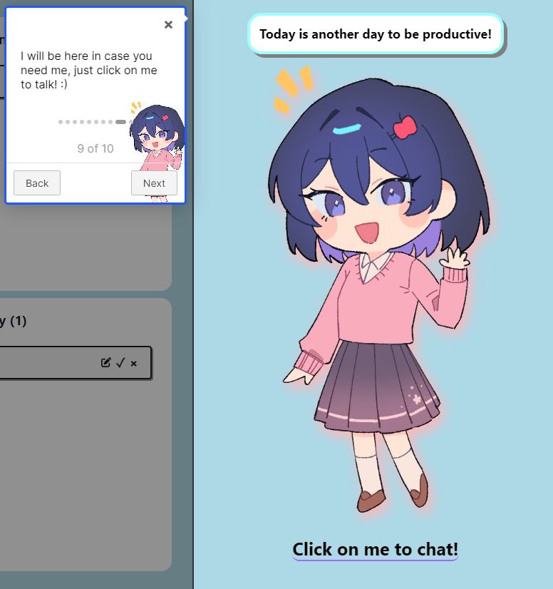
        
        *   By hovering over Mei, users can observe an expression change.
            
            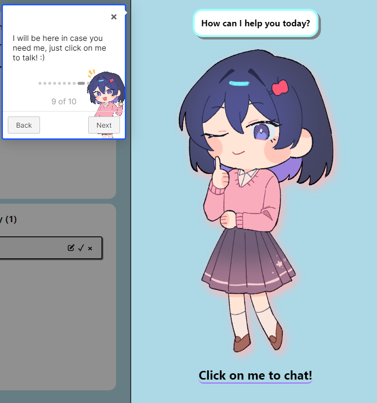
            
        *   Users will then be navigated to the chat room by simply clicking on her!
        
        
        
        *   This is the area where users interacts with Mei by text.
            
            
            
        *   To write a message, simply click on the input area and start typing!
        
        
        
        *   To send the message, users can just press Enter on their keyboards, or click on the send icon on the right-hand side.
        *   When a message is sent, notice an expression change from Mei as she's typing a reply!
        
        
        
        *   Mei will then return to her usual expression with a new response from her appearing in the chat room!
            
            
            
        *   When the AI model receives an input, its neural network will breakdown the sentence string and try to predict its response type.
        *   Once a response type is predicted, a random response will be selected using the random Python library and sent back to the front-end which shows on the user's screen.
        *   Of course, when Mei receives an input which she doesn't understand, the response type would simply be “Unsure” and one random response from the specified array will be returned.
        
        
        
        *   Just like in the home page, a chat bubble is placed above Mei to hint the user in the type of inputs she can take in which changes at random intervals!
        *   We have added a **“Behavior Index”** button at the side so that users can take a look at the behavior index in the application itself by clicking on it.
        *   
            
            Users may input similar texts to (hopefully) obtain the desired response!
            

*   **Automation Task**
    *   Website to allow interaction with Mei to add, edit, and delete tasks.
        
        **Instructions/ Details**
        
        *   In the chat room, users can give commands like add task, edit task, and delete task to initiate the respective task operations.
        *   For **adding a new task**, a form like the one below will be brought up where users can enter the details before confirming.
        
        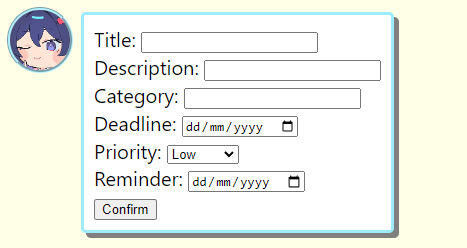
        
        *   For **editing an existing task**, Mei will first ask the user which task they would like to edit (by index), then a similar form but with the fields filled out will appear instead.
        
        
        
        
        
        *   For **deleting an existing task**, Mei will first ask for the index of the task the user would like to delete, then the user will have to send a confirmation input to confirm the deletion.
        
        
        
        
        
        **Quitting an Operation/ Going back a Step**
        
        *   At any point of time during the task operation, the user may send one of the quit inputs (i.e. quit, q, bye, stop, or leave) to quit, or use a back input (i.e. back, go back, or previous) to go back to the previous step of the process.
        *   All the necessary inputs will be mentioned by Mei in the chat room at the beginning of an operation.
        
        
        
        
        
*   **Interactive Messages**
    *   Users to receive messages from AI Assistant for events.  (Greetings for logging in, birthday wishes, simple conversations, etc.)
        
        **Instructions/ Details**
        
        *   Realise how Mei takes note of a new user's birthdate when they sign up? She has uses for them!
        *   During the user's birthday, they will receive a letter from Mei, wishing them a Happy Birthday!
        *   Every time the user logs in, the application checks whether it's their birthday, if it is, a birthday letter pops up! And the data is stored in the local storage, indicating that the user has been wished a Happy Birthday, which will reset its status on the next day.
        
        
        
        **Conversational Chat Bubbles**
        
        *   There is a chat bubble right above the Meis throughout the application. These chat bubbles rotate through an array of speech lines which are set randomly at a random interval. This is to simulate a real assistant interacting with the user in a one-way manner, sometimes giving hints to what the user can do in the application.
        
        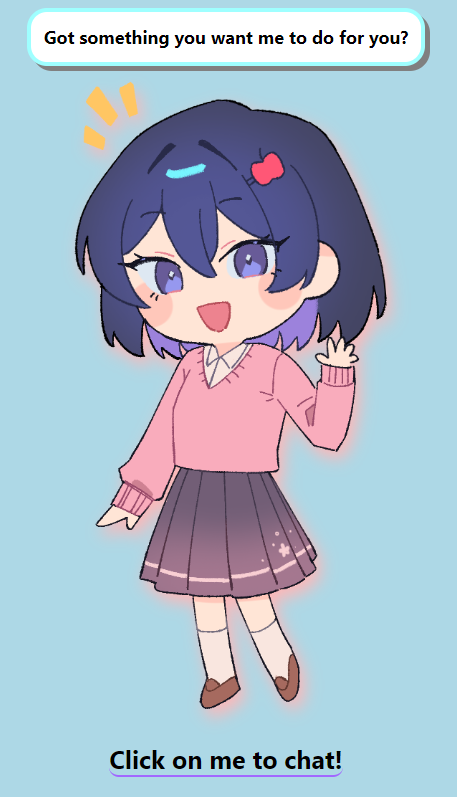
        
*   **Speech Recognition (Text-to-Speech & Speech-to-Text) (In Progress)**
    *   This feature is still under production. Our thought is to use either the Python TTS library or JavaScript to take in voice inputs and return a voice output.

### **Extension Features Details**

*   **User Onboarding**
    
    *   If you have been paying attention to some of the images being shown above, you may have noticed rectangular-sized guide boxes like this.
    
    
    
    *   This is an intro guide implemented using Intro.js! Users are able to get a brief run through of our web application without much confusion. It aims to enhance new user experience getting on board our product!
    *   New users can simply click on Next to go to the next step, Back to go to the previous step, and the x on the top-right corner to skip the intro!
        
*   **Task Priority Suggestion**
    
    *   To allow suggestions by AI based on the priority of task. 
    *   In the future, we can look into task priority suggestions based on the title of the task which can be implemented using text classification. (e.g. Cleaning of Dishes - Low, Meeting with Client - High)
    *   Currently, Mei is only able to tell the user their most prioritsed task in her list.
    
    
    
*   **Recurring Tasks**
    
    *   Site to provide automatic creation of recurring tasks based on creation..
    *   Users will be able to enable/ disable recurring mode for their new and existing tasks.
        
        **Instructions/ Details**
        
        *   To add a recurring task, users can either click on the “Add Recurring Task” button at the home page, or navigate to the Recurring Task page.
        *   There are three main fields that the user will have to enter: “Intervals (Days)”, “Task Creation”, and “Reminder”.
        *   “Intervals (Days)” would be how many days after which should the next task recur.
        *   “Task Creation” refers to how many days should the next recurring task be created **before the deadline**.
        *   “Reminder” is how many days should the reminder happen **before the deadline**.
    
*   **Exchange of Items using Points**
    *   To provide a “shop” to exchange decorative items for the Assistant AI.
    *   Decoration and customisation of the Assistant AI character will bring gamification and engagement to users.
        
        **Instructions/ Details**
        
        *   Users can navigate to the Shop page via the Navigation Bar.
        
        
        
        *   At the shop, users will be able to purchase customisables in which they can use for their profile.
        *   At this stage, we plan to have mainly two types of customisables that users can purchase with their points, Assistant Outfits and Profile Icons!
        *   As we still have not received the outfit sprites and icons, we have placed temporary images to substitute for the actual one which will be added soon.
        *   If the user has insufficient points, the button will show accordingly.
        
        
        
        *   To exchange for an item, simply click on the “Exchange” button, and a confirmation window will pop up!
        
        
        
        *   Once the item has been exchanged, the button will be shown as “Obtained” and become non-interactable.
        
        
        
*   **User Profile**
    *   To allow users to check out their profile details, items owned/ purchased, their friends and friend requests.
        
        **Instructions/ Details**
        
        *   To navigate to the user profile, simply click on the user info section in the top right corner of the page next to the Log Out button.
        
        
        
        *   Then, the user will be greeted with their profile page!
        
        
        
        *   Here, the user is able to view their profile details, friends list, friend requests, as well as search for other users!
        *   Moreover, the user can check out their items in the Item Collection Box, and equip them.
        
        
        
        *   Items that are exchanged from the shop are displayed in this area!
        *   To equip the item, simply click on the “Equip” button, which will then update the user's profile accordingly, and show “Equipped” afterwards.
            

### Milestone Timeline

<table><tbody><tr><td>Milestone</td><td>Tasks</td><td>Month</td><td>Week(s)</td></tr><tr><td rowspan="5">1</td><td><p>Research on relevant technologies, including</p><p>speech recognition and neural networks.</p></td><td rowspan="5">May</td><td rowspan="2">3</td></tr><tr><td><p>Pick up the necessary tech knowledge for front-end</p><p>back-end and attending Mission Control Workshops.</p></td></tr><tr><td>Set up the front-end by creating a basic interface for home, sign up, login and task pages.</td><td rowspan="3">4</td></tr><tr><td>Research on the databases to use for back-end, set it up, and achieve a successful connection between the front-end and back-end.</td></tr><tr><td>Completion of the sign up form and implement error handling for it in both front and back-ends.</td></tr><tr><td rowspan="9">2</td><td>Implementation of authentication for signed-in users.</td><td rowspan="9">June</td><td rowspan="3">1</td></tr><tr><td>Complete the login page with error handling for it.</td></tr><tr><td>Implementation of all the task-related functions. (Add, Edit, Delete, and Complete w/ Calculation of points earned)</td></tr><tr><td>Implementation of a reminder prompt when near the deadline/ reminder time indicated by the user.</td><td rowspan="3">2</td></tr><tr><td>Complete task viewer page with the categorization feature.</td></tr><tr><td>Implementation of User Productivity Report Analysis.</td></tr><tr><td><p>Begin preparation for implementation of the Virtual Assistant.</p><p>(Character design, personality)</p></td><td rowspan="3">3, 4</td></tr><tr><td>User input features (Speech recognition, Natural Language Processing)</td></tr><tr><td>Interactive Voice Lines (Write-up) (Implementation if there's time)</td></tr><tr><td rowspan="10">3</td><td>Further Improvements to the AI of the Virtual Assistant.</td><td rowspan="10">July</td><td rowspan="3">1</td></tr><tr><td>Research into ways to give the Virtual Assistant an actual human voice.</td></tr><tr><td><p>Tidy up the front-end of the web application.&nbsp;</p><p>(Adding better CSS styling for a greater user experience)</p></td></tr><tr><td>Implementation of the AI voice.</td><td rowspan="3">2</td></tr><tr><td>Continue to work on when would each voice line be said in the web application.</td></tr><tr><td>Task prioritisation by the Virtual Assistant.</td></tr><tr><td>Implementation of Recurring Task (Periodically Recurring Tasks).</td><td rowspan="4">3, 4</td></tr><tr><td>Points Exchange System.</td></tr><tr><td>Design of Decorative Items and Accessories for the Virtual Assistant.</td></tr><tr><td>Final Brush Ups to the system.</td></tr></tbody></table>

### Diagrams

**Database Diagram**


**Sequence Diagram**


**User Flow Diagram**


### Software Engineering Principles

*   **Front-End Unit Testing**
    *   Unit Testing for the frontend components were conducted using Vitest and React Testing-Library. As of now, only the tasks and tasksbox have simple tests to run and more will be added for other units / components.
    *   Certain functions are also unit tested using Jest to ensure that they work as intended.
    *   Some examples of unit tests are shown below:
        
        
        
        
        
        
        
        
        
        
        
*   **BackEnd Unit Testing**
    *   Unit Testing for the backend API server conducted using Postman API Testing to verify that API functions correctly when the request is sent from the client.
*   **User Testing**
    *   We have conducted user testing with some of our friends and family members. The testing was conducted using the deployed version.
    *   While the users were testing the web application, we were watching how they were interacting with the application, constantly looking out for potential bugs and seeking feedback from the users in terms of their experience using and navigating through the application.
    *   Some unexpected bugs were discovered and resolved on the spot.
    *   We've received feedbacks and criticism as follows:
        *   Navigation is generally not a problem with the simple user interface (UI), it is clear in terms of which buttons lead to which pages.
        *   The UI is not confusing or difficult to look at.
        *   Users are satisfied and entertained by the chat bot system.
        *   User experience is generally good but some quality of life changes could be made.
        *   More clarifications/ better and clearer labelling are needed for the “Category”, “Task Creation”, and “Reminder” before deadline fields when adding a recurring task.
        *   “Task Creation” before deadline field does not seem necessary as the next recurring task should be added automatically right as the previous one is overdue.
        *   Mono color may be too simple and background colors could be slightly fancier. Yellow is also too bright for the eyes.
    *   Users also suggested extension features such as:
        *   Dark/ light mode.
        *   Add exact timings to deadlines and reminders.
        *   Account deletion feature.
        *   Addition of points by interacting with the assistant to encourage interaction.
        *   New behaviors such as responding to “How to quit?” and “What are my upcoming/ overdue tasks?”.
*   **Version Control**
    *   Version Control using Github - Working on features on different branches, merge and pull requests.
        
        
        
*   **Code Readability**
    *   Commenting on code to ensure readability and clarity for developers.
    *   Below are some examples of comments added:
        
        
        
        
        
        
        
*   **Single Responsibility Principle**
    *   Ensuring each component has only one responsibility.
*   **Documentation**
    *   The front-end and back-end of the application has been documented using the format of JSDoc.
    *   Below are some examples of documentation written:
        
        
        
        
        
        
        
        
        

### Technical Proof of Concept

[https://drive.google.com/file/d/1zJ-W6Mnwhf3kvtDq5AHZDyBLQlX40LVF/view](https://drive.google.com/file/d/1zJ-W6Mnwhf3kvtDq5AHZDyBLQlX40LVF/view)

### Project Log

[https://docs.google.com/spreadsheets/d/17HxSnRviubHJgGpeZq1HtBrLmgk7EVS24I_u2EfXtiA/edit?usp=sharing](https://docs.google.com/spreadsheets/d/17HxSnRviubHJgGpeZq1HtBrLmgk7EVS24I_u2EfXtiA/edit?usp=sharing)

### Mei's Behavior Index

<table><tbody><tr><td>Input Pattern</td><td>Response Description</td></tr><tr><td><ul><li>Who are you?</li><li>What’s your name?</li><li>Can you introduce yourself.</li></ul></td><td>Introduction of the AI Assistant to the user.</td></tr><tr><td><ul><li>Give me all my tasks.</li><li>My list of tasks.</li><li>What tasks do I have?</li></ul></td><td>The complete list of the user's tasks.</td></tr><tr><td><ul><li>Favorite food.</li><li>What is your favorite food?</li><li>What do you like to eat?</li></ul></td><td>Free talk about the AI Assistant's favorite food.</td></tr><tr><td><ul><li>Favorite color.</li><li>What is your favorite color?</li><li>What color do you like?</li></ul></td><td>Free talk about the AI Assistant's favorite color.</td></tr><tr><td><ul><li>What do you like?</li><li>What are your hobbies?</li></ul></td><td>Free talk about the Assistant's hobbies.</td></tr><tr><td><ul><li>Shop.</li><li>Tell me about the shop.</li><li>What is the shop?</li></ul></td><td>Introduction to the application's shop page.</td></tr><tr><td><ul><li>Completion.</li><li>Completing tasks.</li><li>Incompletion.</li></ul></td><td>Introduction to the application's task completion/ uncompletion system.</td></tr><tr><td><ul><li>Productivity Report.</li><li>What is my productivity report?</li><li>Tell me about the productivity report.</li></ul></td><td>Introduction to the application's productivity report system.</td></tr><tr><td><ul><li>Hey!</li><li>Hello.</li><li>Good to see you.</li><li>How are you?</li><li>What's Up?</li><li>Hi.</li></ul></td><td>Greeting the user.</td></tr><tr><td><ul><li>Can you add a task for me?</li><li>Add a task.</li><li>Add task.</li></ul></td><td>Guides the user through the process of adding a new task.</td></tr><tr><td><ul><li>Can you delete this task for me please?</li><li>Delete a task.</li><li>Delete task.</li></ul></td><td>Guides the user through the process of deleting an existing task.</td></tr><tr><td><ul><li>Can you edit this task for me please?</li><li>Edit a task.</li><li>Edit task.</li></ul></td><td>Guides the user through the process of editing an existing task.</td></tr><tr><td><ul><li>What is the weather today?</li><li>Weather.</li></ul></td><td>Informs the user about the weather in their local area.</td></tr><tr><td><ul><li>Priority task.</li><li>Highest prioritised task.</li><li>What tasks should I prioritise.</li></ul></td><td>A suggestion from the AI Assistant about the user's highest prioritised task.</td></tr><tr><td><ul><li>Recurring Task.</li><li>What are recurring tasks?</li><li>Tell me about recurring tasks.</li></ul></td><td>Introduction to the application's recurring task system.</td></tr></tbody></table>

### Artist

Our artist that has supported and provided us with the sprites for our character Mei, is Rena!

Her Twitter/ X: [https://twitter.com/__rrena](https://twitter.com/__rrena) (@\_\_rrena)

### Art Gallery

Here is the full gallery of artworks that Rena has provided us with.

*   Excited Mei
    
    
    
*   Winking Mei
    
    
    
*   Waving Mei
    
    
    
*   Staring Mei
    
    
    
*   Texting Mei
    
    
    
*   Chibi Icon Mei
    
    