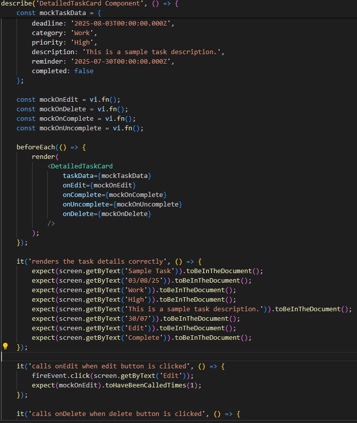

## NUS Orbital - Milestone 1 Submission

### Team Name :

Assistant AI 助手 AI

### Proposed Level of Achievement :

Apollo 11

### Motivation

Our web application, 助手 AI , which stands for Assistant AI in Japanese, will be a task management web application that allows users to track and organise their due tasks for better productivity and boosts user engagement via implementing a virtual assistant character.

With our Web Application, we aim to add utility and functionality with personalization. We understand that people have personal, work and familial responsibilities, which are all bound to have tasks to be completed. 助手 AI aims to help users organise tasks, record ongoing progress and provide analytics on their current productivity with a personal Assistant AI to serve reminders and engage users as their own personal characters.

### Aim

Our goal is to develop a task management application that helps users to organize their tasks efficiently and encourage commitment to task fulfillment through a personal rewards system.

### User Stories

1.  As a University student who has a lot of tasks at hand, I sometimes don't feel the motivation to complete my tasks.
2.  As a student who always create and organize my tasks on my smartphone, I wish that someone would help me automate that process through voice commands.
3.  As a Computer Science student who spends most of my time in front of a screen, sometimes I get too carried away and notifications of my tasks would go unnoticed and I would miss a deadline, I wish there was an assistant who would verbally remind me of those tasks.
4.  As a University student who has to juggle between multiple tasks of different levels of priorities, I wished there was AI who could help me with that and give reminders based on deadline priority.

### Tech Stack

1.  Frontend - React, HTML, CSS
2.  Backend - Node.js, Express.js
3.  Database - MySQL
4.  Unit Testing - Jest, Vitest & React Testing Library

### User Guide

1.  Users are required to have the following installed: Node.js, Express.js and MySQL
2.  After cloning, users need to setup a MySQL database and configure it to the config folder by matching the name and password
3.  For running the frontend, users may run "npm run dev" from /client
4.  For running the backend, users may run "npm run server" from /server

### Project Scope

Assistant AI is essentially a task management system with the help of a Virtual Assistant to automate simple tasks for a more interactive user experience.

#### Features Summary

#### Core

1.  Users to be able to **sign up** for account.
2.  Users to be able to **log in / log out** of account.
3.  Users to be able to **add tasks.**
4.  Users to be able to **edit tasks.**
5.  Users to be able to **delete tasks.**
6.  Users to be able to **complete tasks.**
7.  Users to be able to **uncomplete tasks.**
8.  Users to **receive reminders** on time.
9.  Users to be able to **view tasks** by **categorisation.**
10.  User **productivity report analysis (based on task completion).**
11.  User voice to provide input to **automate each task.**
12.  Interactive voice lines **(Birthday wishes, greetings, daily life conversations).**

**Extensions**

1.  Tasks Prioritisation Suggestion by AI.
2.  Recurring Task (Periodically Recurring Tasks).
3.  Exchange of Points for Decorative Items and Accessories for the Virtual Assistant.

#### Core Features Details

*   **Sign Up**
    *   User to be able to sign up for new account using a **unique** username and password
    *   Username to be unique, user to face error if signing up for new account using existing username
    *   Users to start off with 0 points
*   **Login / Logout**
    *   On Login, users should be redirected to the home page where there is a dashboard that displays the following
    *   Tasks by deadline and priority
    *   Reminders of Tasks
    *   User Productivity Rate
    *   On Logout, users should be redirected to the login page
*   **Add Tasks**
    *   Users to be able to add tasks with the following fields:
    *   Title
    *   Description
    *   Category
    *   Priority
    *   Reminder (DateTime)
    *   Deadline (DateTime)
*   **Edit Tasks**
    *   Users to be able to edit the following fields for a task:
    *   Title
    *   Description
    *   Category
    *   Priority
    *   Reminder (DateTime)
    *   Deadline (DateTime)
*   **Delete Tasks**
    *   Users to be able to delete tasks from the dashboard / edit task section
*   **Complete Tasks**
    *   Users to be able to press complete task, in which task completion will reward users with XP points. Late completion of tasks will reward with 1 points.
*   **Uncomplete Tasks**
    *   Users to be able to press uncomplete task, in which points earned will be deducted.
*   **Receive Reminders** (To be developed further)
    *   Users to receive reminders from the AI Assistant when the task has reached the reminder date
*   **View Tasks - Categorisation**
    *   Users to be able to sort their task list using a sidebar that shows the filters available
*   **Productivity Report**
    *   Generate a productivity report showing productivity rate based on number of tasks completed, date of task completion relative to deadline, and priority of tasks completed
    *   Tasks completed before the deadline will result in higher productivity
    *   Tasks completed after the deadline will result in lower productivity
    *   Tasks yet to be completed after the deadline will also result int lower productivity
    *   The priority of tasks will affect the weightage and its increase on decrease in productivity rate
*   **Automation Task** (In Progress)
    *   Website to allow voice input to generate and fill in task fields using speech recognition
*   **Interactive Voice Lines** (In Progress)
    *   Users to receive voice output from AI Assistant for events  (Greetings for logging in, birthday wishes, simple conversations, etc.)

**Extension Features**

*   **Task Priority Suggestion**
    *   To allow suggestions by AI on the priority of task based on title of task (e.g. Cleaning of Dishes - Low, Meeting with Client - High)
*   **Recurring Tasks**
    *   Site to provide automatic creation of recurring tasks based on creation
    *   Daily / Weekly / Monthly (To be explored)
*   **Exchange of Items using Points**
    *   To provide a “shop” to exchange decorative items for the Assistant AI
    *   Decoration and customisation of the Assistant AI character will bring gamification and engagement to users

### Milestone Timeline

<table><tbody><tr><td>Milestone</td><td>Tasks</td><td>Month</td><td>Week(s)</td></tr><tr><td rowspan="5">1</td><td>
Research on relevant technologies, including

speech recognition and neural networks.
</td><td rowspan="5">May</td><td rowspan="2">3</td></tr><tr><td>
Pick up the necessary tech knowledge for front-end

back-end and attending Mission Control Workshops.
</td></tr><tr><td>Set up the front-end by creating a basic interface for home, sign up, login and task pages.</td><td rowspan="3">4</td></tr><tr><td>Research on the databases to use for back-end, set it up, and achieve a successful connection between the front-end and back-end.</td></tr><tr><td>Completion of the sign up form and implement error handling for it in both front and back-ends.</td></tr><tr><td rowspan="9">2</td><td>Implementation of authentication for signed-in users.</td><td rowspan="9">June</td><td rowspan="3">1</td></tr><tr><td>Complete the login page with error handling for it.</td></tr><tr><td>Implementation of all the task-related functions. (Add, Edit, Delete, and Complete w/ Calculation of points earned)</td></tr><tr><td>Implementation of a reminder prompt when near the deadline/ reminder time indicated by the user.</td><td rowspan="3">2</td></tr><tr><td>Complete task viewer page with the categorization feature.</td></tr><tr><td>Implementation of User Productivity Report Analysis.</td></tr><tr><td>
Begin preparation for implementation of the Virtual Assistant.

(Character design, personality)
</td><td rowspan="3">3, 4</td></tr><tr><td>User input features (Speech recognition, Natural Language Processing)</td></tr><tr><td>Interactive Voice Lines (Write-up) (Implementation if there's time)</td></tr><tr><td rowspan="10">3</td><td>Further Improvements to the AI of the Virtual Assistant.</td><td rowspan="10">July</td><td rowspan="3">1</td></tr><tr><td>Research into ways to give the Virtual Assistant an actual human voice.</td></tr><tr><td>
Tidy up the front-end of the web application.&nbsp;

(Adding better CSS styling for a greater user experience)
</td></tr><tr><td>Implementation of the AI voice.</td><td rowspan="3">2</td></tr><tr><td>Continue to work on when would each voice line be said in the web application.</td></tr><tr><td>Task prioritisation by the Virtual Assistant.</td></tr><tr><td>Implementation of Recurring Task (Periodically Recurring Tasks).</td><td rowspan="4">3, 4</td></tr><tr><td>Points Exchange System.</td></tr><tr><td>Design of Decorative Items and Accessories for the Virtual Assistant.</td></tr><tr><td>Final Brush Ups to the system.</td></tr></tbody></table>

### Diagrams

**Database Diagram**

**Sequence Diagram**

**User Flow Diagram**

### Software Engineering Principles

*   **Front-End Unit Testing**
    *   Unit Testing for the frontend components were conducted using Vitest and React Testing-Library. As of now, only the tasks and tasksbox have simple tests to run and more will be added for other units / components.
    *   Certain functions are also unit tested using Jest to ensure that they work as intended.
    *   Some examples of unit tests are shown below:
        
        
        
        
        
        
        
        
        
        
        
*   **BackEnd Unit Testing**
    *   Unit Testing for the backend API server conducted using Postman API Testing to verify that API functions correctly when the request is sent from the client.

*   **Version Control**
    *   Version Control using Github - Working on features on different branches, merge and pull requests.
        
        

*   **Code Readability**
    *   Commenting on code to ensure readability and clarity for developers.
    *   Below are some examples of comments added:
        
        
        
        
        
        
        
*   **Single Responsibility Principle**
    *   Ensuring each component has only one responsibility.

*   **Documentation**
    *   The front-end and back-end of the application has been documented using the format of JSDoc.
    *   Below are some examples of documentation written:
        
        
        
        
        
        
        
        
        

### Technical Proof of Concept

[https://drive.google.com/file/d/1zJ-W6Mnwhf3kvtDq5AHZDyBLQlX40LVF/view](https://drive.google.com/file/d/1zJ-W6Mnwhf3kvtDq5AHZDyBLQlX40LVF/view)

### Project Log

[https://docs.google.com/spreadsheets/d/17HxSnRviubHJgGpeZq1HtBrLmgk7EVS24I_u2EfXtiA/edit?usp=sharing](https://docs.google.com/spreadsheets/d/17HxSnRviubHJgGpeZq1HtBrLmgk7EVS24I_u2EfXtiA/edit?usp=sharing)